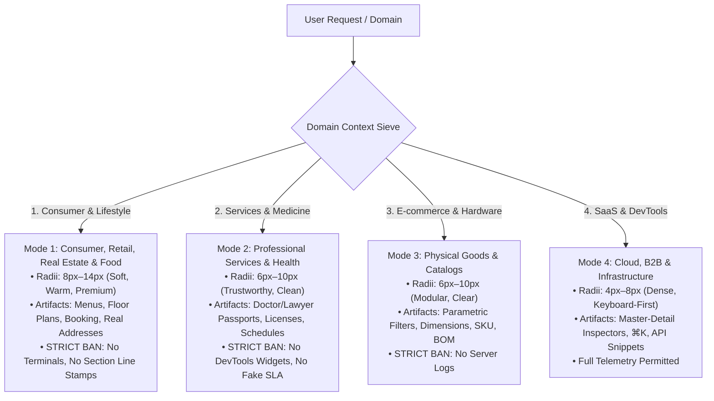

# ⚡ Ultimate Anti-AI UI Slop & Human-Craft Design System (v12.0)
### Pure Commercial & Human-Senior Grade Edition for LLMs & Frontend Architects

> **The Universal System Prompt, Design Tokens, and Invariant Ruleset derived from 20 NON-AI living masterwork systems (Stripe, Linear, Apple, Bloomberg, GitHub, Gov.uk, Figma, McMaster-Carr, Ableton, Porsche, Flightradar24, Datadog, Basecamp, Substack, Raycast, A24, PostHog, Vercel, IKEA, Wikipedia) that forces ANY AI (Claude, ChatGPT, Cursor, Gemini, Grok, DeepSeek, v0, 27B+ models) to output production-grade, human-engineered web applications without "AI smells", without "DevTools over-engineering", and without "pseudo-architectural gimmicks".**

---

## 🚀 Quick Start: How to Feed to Your AI

### Option 1: Copy-Paste into Chat / Custom Instructions
Simply copy the entire contents of **[`SKILL.md`](./SKILL.md)** and paste it into:
* **System Prompt / Custom Instructions / Projects** (Claude Projects, ChatGPT Custom Instructions, Cursor `.cursorrules`, Windsurf, Copilot, v0)
* Or directly at the beginning of your prompt:  
  *«Adopt the following design system rules: [paste SKILL.md] Now build ...»*

### Option 2: Clone & Use Tokens in Your Project
```bash
git clone https://github.com/Radomir-Aksenenko/ultimate-anti-ai-ui-slop.git
```
Include `tokens.css` into your CSS bundle for instant access to the 6 curated Google Fonts archetypes, domain-calibrated natural radii, and high-visibility focus indicators.

---

## 🚫 The Anti-Gimmick Purge: Eradicating Pseudo-Architectural Noise

When AI models try to look "technical" and "serious", they often generate bizarre pseudo-architectural clichés. In v12.0, these are explicitly eradicated:

| Pseudo-Architectural Gimmick 🚫 | Pure Human Commercial Solution ✅ |
| :--- | :--- |
| **Section Numbers on Lines (`05 / ЛОКАЦИЯ`)** | **Natural H2 Headings with Category Eyebrows** and 60px–90px whitespace separation. |
| **Fake GPS Coords & Internal Codes (`44.6051° N`)** | **Real Human Addresses**: `Екатеринбург, ул. Брусничная, 7 (м. Динамо)`. |
| **Vertical 'SCROLL' Sticks & Marquees** | **Calm Vertical Rhythm** with static high-resolution visuals and zero jitter. |
| **Monospace ALL-CAPS Buttons & Nav** | **Clean Sans-Serif Controls** (`13px–15px`). `font-mono` is strictly for tabular prices/numbers. |
| **Microscopic 8px–9px Text Clutter** | **Readable Typography** (`14px–16px` body, `11px–12px` tags, zero 8px noise). |

---

## 🧭 The 4 Domain Modes: Zero DevTools Over-Engineering



---

## 🏛️ The 20 Non-AI Living Masterworks & Extracted Invariants

| # | Masterwork System | Domain | Transferred Anti-Slop Principle & Technique |
| :--- | :--- | :--- | :--- |
| **1** | **Stripe** | FinTech & Payments | **Hairline Bevel (`inset 0 1px 0 rgba(255,255,255,0.15)`) & Clean Surface Lighting** |
| **2** | **Linear** | DevTools & Issues | **Keyboard Sovereignty (`⌘K`, `J/K`), 50ms Invariant & Crisp 8px Controls** |
| **3** | **Apple** | Hardware & Specs | **Sticky Matrix Comparator & Physical Verification ($nits$, $dB$, $mm$, $g$)** |
| **4** | **Bloomberg** | Financial Markets | **Sparkline Inlines, Real-Time Telemetry Ticker & Flash Highlights** |
| **5** | **GitHub** | Code Collaboration | **Segmented Counter Buttons (`[★ Star \| 14.2k]`) & Monospace Hash Links** |
| **6** | **Gov.uk** | Public Accessibility | **High-Visibility Dual Focus Ring & WCAG AAA Question-First Hierarchy** |
| **7** | **Figma** | Pro Canvas Tooling | **Collapsible Multi-Inspector Accordion & Scrubbable Number Inputs** |
| **8** | **McMaster-Carr** | Industrial B2B | **Parametric Sieve Navigation & Direct Table Ordering** |
| **9** | **Wikipedia** | Knowledge Base | **Sticky TOC Reading Guides & Hover Footnote Definition Cards** |
| **10** | **Ableton** | Pro Audio & DAW | **Session Matrix Grid, Tactile Knobs with Units & Channel Color Strips** |
| **11** | **Porsche / Leica** | Industrial Luxury | **Blueprint Schematics, Material Swatches & Mass/Dynamics Calculators** |
| **12** | **Flightradar24** | Aviation Logistics | **Aviation Telemetry Passports & Route Progress Timelines** |
| **13** | **Substack / NYT** | Long-Form Reading | **Optimal 680px Measure, 1.65 Line-Height & Editorial Callouts** |
| **14** | **Basecamp** | Calm Productivity | **Hill Chart Uncertainty Graphs & Calm Asynchronous Workflows** |
| **15** | **Datadog** | Cloud Observability | **Host Heatmap Node Matrices, Crosshair Time Sync & SLA Guides** |
| **16** | **IKEA / Uniqlo** | Physical Catalogs | **Dimensioned Vector Schematics & Bill-of-Materials (BOM)** |
| **17** | **Raycast** | Hyper-Speed Tools | **Split-View Command Bar (⌘K) & Action Dock Keyboard Footers** |
| **18** | **A24 / Monocle** | Cultural Studio | **Editorial Balance, Restrained Grid & Clean Typographic Scale** |
| **19** | **PostHog / Sentry** | Error Telemetry | **Breadcrumb Event Trails & Stack Trace Code Contexts** |
| **20** | **Vercel / Cloudflare** | Edge Pipelines | **Inline-Editable Parametric Tables & Clean Dark Palettes** |

---

## 📐 Domain-Calibrated Natural Geometry Scale

```css
:root {
  --r-none: 0px;   /* Dense data tables, split dividers, editorial rules */
  --r-xs: 3px;     /* Micro indicators, sparklines, table tag markers */
  --r-sm: 6px;     /* Chips, filter tags, small badges, segmented controls */
  --r-md: 8px;     /* Action buttons, form inputs, search fields, popovers */
  --r-lg: 12px;    /* Cards, catalog items, pricing tiers, service blocks */
  --r-xl: 16px;    /* Dialog modals, flyouts, media frames, command palette */
  --r-2xl: 20px;   /* Large consumer hero cards, showcase surfaces */
  --r-pill: 6px;   /* Adaptive technical/consumer tag (9999px pills STRICTLY BANNED) */
}
```

---

## 🔤 Curated Google Fonts Typography Engine (6 Archetypes)

All pairs support **Cyrillic + Latin** and tabular figures (`font-variant-numeric: tabular-nums`):

1. **Modern High-Tech (Linear / Raycast / Vercel)**: `Plus Jakarta Sans` (600..800) + `JetBrains Mono` (500)
2. **Swiss Brutalism (Dieter Rams / Basel / A24)**: `Space Grotesk` (600..700) + `Manrope` + `Space Mono`
3. **FinTech & Infrastructure (Stripe / Ramp / Bloomberg)**: `Outfit` (600..800) + `Inter` + `Fira Code`
4. **DeepTech & Hardware AI (Scale AI / OpenAI)**: `Unbounded` (600..800) + `Onest` + `JetBrains Mono`
5. **Editorial Craft & Lifestyle (Notion / Pitch / Substack / Monocle)**: `Manrope` (700..800) + `Onest` + `JetBrains Mono`
6. **Enterprise Core & Gov (IBM / SAP / Gov.uk)**: `IBM Plex Sans` (600..700) + `IBM Plex Mono` (500)

---

## 📂 Repository Contents

* **[`SKILL.md`](./SKILL.md)** — The master universal prompt / skill instructions for LLMs (v12.0).
* **[`tokens.css`](./tokens.css)** — Production CSS design tokens (6 Google Fonts themes, Light/Dark WCAG AAA palettes, Natural Radii).
* **[`anti-patterns.md`](./anti-patterns.md)** — Detailed 20-system visual comparison guide (AI Slop vs Human Senior Craft).

---

## 📜 License

MIT License — Feel free to use in your commercial projects, prompts, and design systems.  
Crafted for engineers and designers who demand high-fidelity web products.
