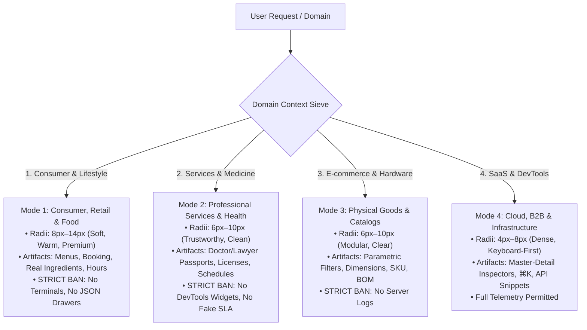
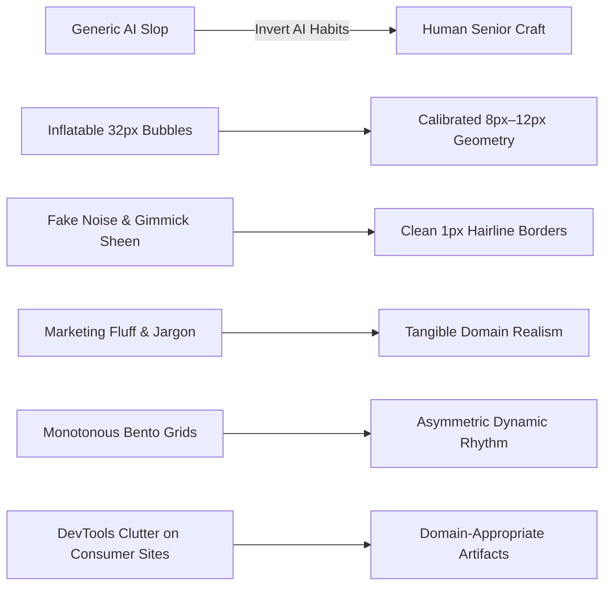

# Enterprise Human-Craft Master System (v11.0)
### Universal Blueprint for Human-Senior Grade Digital Products Across ANY Industry Domain

> **THE SUPREME DIRECTIVE**:
> **Never build decorative AI toys, inflatable 'bubble-pill' mockups, or generic Dribbble fluff. Equally, never blindly dump DevTools widgets (terminals, JSON boxes, commit hashes, WebSocket pings) onto normal everyday consumer, lifestyle, medical, or service websites. Deliver calm, confident, domain-calibrated, production-grade web applications that feel engineered by a Principal Frontend Architect and a Staff Product Designer.**

---

## 0. DOMAIN CONTEXT SIEVE: CALIBRATING ARTIFACTS & DENSITY PER INDUSTRY

Before writing a single line of CSS or markup, identify the project's **Domain Mode** to select appropriate components, geometry, and copywriting tone:



### Mode 1: Consumer, Hospitality, Food & Lifestyle
*(Bakeries, Restaurants, Coffee Shops, Boutiques, Salons, Hotels, Fitness, Creative Portfolios)*
* **Visual Atmosphere**: Warm, tactile, generous whitespace, appetizing/editorial typography, natural soft geometry (`--r-md: 8px`, `--r-lg: 12px`, `--r-xl: 16px`).
* **Authentic Artifacts**:
  - Structured visual menu with real ingredients, dietary markers, and clear pricing ($₽ / \$ / €$).
  - Instant table/service reservation picker (Date, Time slot, Party size, Specialist).
  - Physical location passport (Street address, Metro station, Opening hours: `Пн–Пт 07:30–22:00`, Map thumbnail).
  - Seasonal specials & verified customer provenance tags (`★ Постоянный гость с 2021`).
* 🚫 **HARD DOMAIN BANS**: **Zero terminal logs, zero JSON API drawers, zero WebSocket pings, zero RPS/p99 latency tickers, zero commit hash badges.**

### Mode 2: Professional Services, Health, Legal & Architecture
*(Law Firms, Medical/Dental Clinics, Architecture Studios, Accounting, Education, Consulting)*
* **Visual Atmosphere**: Authoritative, calm, pristine contrast, structured grid, trustworthy geometry (`--r-md: 8px`, `--r-lg: 10px`, `--r-xl: 14px`).
* **Authentic Artifacts**:
  - Specialist credential passports (Doctor/Partner photo, Years of practice, University, Medical category / Bar association license #).
  - Practice areas / Treatment plans with step-by-step clinical protocol and clear price ceilings.
  - Appointment scheduling modal / Quick consultation form with file attachment.
  - Institutional certifications (Ministry of Health license, ISO, Chamber of Commerce).
* 🚫 **HARD DOMAIN BANS**: **Zero dev server metrics, zero raw code blocks, zero abstract system charts.**

### Mode 3: E-commerce, Physical Catalog & Hardware Logistics
*(Furniture, Industrial Tools, Fashion Brands, Automotive, Construction Supply)*
* **Visual Atmosphere**: Precise, modular, product-first, tactile swatches (`--r-md: 6px`, `--r-lg: 10px`, `--r-xl: 14px`).
* **Authentic Artifacts**:
  - Parametric filter sieve (Dimensions $W\times H\times D$, Weight $kg$, Material, Color swatches, Power $kW$).
  - Vector CAD/schematic dimension blueprint with exploded parts breakdown (Bill-of-Materials).
  - Real-time stock badge per warehouse location (`В наличии: 14 шт. на складе Юг`).
  - Tiered volume pricing matrix with bulk discount brackets.

### Mode 4: SaaS, Enterprise Software, FinTech & DevTools
*(Cloud Platforms, Analytics, Developer Tools, Financial Trading, Database Management)*
* **Visual Atmosphere**: Hyper-dense, keyboard-first, monospace data layers, crisp micro-radii (`--r-sm: 4px`, `--r-md: 6px`, `--r-lg: 8px`).
* **Authentic Artifacts**:
  - Master-Detail split-view inspectors with live property binding.
  - Real-time telemetry ticker strips, sparklines, and server health heatmaps.
  - Stripe-style materialization of API JSON payloads and cURL snippets.
  - Command palette (`⌘K`), keyboard shortcut action dock, and terminal event stream.

---

## 1. THE 20 NON-AI LIVING MASTERWORKS & THEIR EXTRACTED INVARIANTS

| # | Masterwork System | Domain | Transferred Anti-Slop Principle & Technique |
| :--- | :--- | :--- | :--- |
| **1** | **Stripe** | FinTech & API Infrastructure | **Hairline Bevel (`inset 0 1px 0 rgba(255,255,255,0.15)`) & Live API Materialization.** Code samples feel like live terminals, not decorative images. |
| **2** | **Linear** | DevTools & Issue Tracking | **Keyboard Sovereignty & 50ms Invariant.** Full `⌘K` command palette, single-key shortcuts (`J/K`, `C`), and ultra-dense 36px list rows. |
| **3** | **Apple (Tech Specs)** | Hardware Specs & Precision | **Sticky Matrix Comparator & Physical Verification.** Strict dimensional tables with physical units ($cd/m^2$, $nits$, $dB$, $mm$, $g$) and sticky headers. |
| **4** | **Bloomberg Terminal** | Financial Telemetry & Markets | **Sparkline Inlines & Differential Flash Highlights.** High-density numeric matrices with inline trendlines and real-time ticker stream. |
| **5** | **GitHub** | Code Collaboration & Diffs | **Segmented Counter Buttons (`[★ Star \| 14.2k]`) & Monospace Hash Links.** Unified diffs and compact collapsible tree explorers. |
| **6** | **Gov.uk** | Public Accessibility (WCAG AAA) | **High-Visibility Dual Focus Ring & Question-First Hierarchy.** Crystal-clear plain language without jargon; 7:1 minimum contrast. |
| **7** | **Figma** | Professional Canvas & Tooling | **Collapsible Multi-Inspector Accordion & Scrubbable Inputs.** Drag-to-adjust numeric controls and floating action shelves. |
| **8** | **McMaster-Carr** | Industrial B2B Catalog | **Parametric Sieve Navigation & Direct Table Ordering.** Zero decorative fluff; instant ordering from multi-attribute parametric data grids. |
| **9** | **Wikipedia / Craigslist** | Hypertext Knowledge Base | **Sticky TOC Reader & Hover Footnote Preview Cards.** Fast reading ergonomics, zero-baggage layout, and instant definition popovers. |
| **10** | **Ableton / Bandcamp** | Pro Audio & Sound Engineering | **Session Matrix Cell Launcher & Channel Color Strips.** Tactile parameter knobs with verified physical units ($Hz$, $dB$, $ms$). |
| **11** | **Porsche / Leica** | Industrial Mechanical Luxury | **Blueprint Schematics & Material Swatches.** CAD cross-section diagrams, tolerance tables, and dynamic weight/dynamics calculators. |
| **12** | **Flightradar24** | Aviation Logistics & Tracking | **Aviation Telemetry Passports & Live Route Progress Timelines.** Precise ICAO/IATA formatting, speed/altitude profiles, and layer toggles. |
| **13** | **Substack / NYT** | Editorial Typography | **Optimal Measure (640–720px) & 1.65 Line-Height.** Perfect vertical reading rhythm, pull-quotes, and thin reading progress indicator. |
| **14** | **Basecamp (37signals)** | Calm Team Productivity | **Hill Chart Uncertainty Graphs & Calm Asynchronous UI.** No panic-inducing red badges; grouped digest streams and organic workflows. |
| **15** | **Datadog / Grafana** | DevOps Cloud Observability | **Host Heatmap Node Matrices & Crosshair Time Sync.** Synchronized multi-chart inspections with explicit dashed SLA threshold lines. |
| **16** | **IKEA / Uniqlo** | Modular Physical Catalogs | **Dimensioned Vector Schematics & Bill-of-Materials (BOM).** Exploded parts lists, physical arrow callouts, and modular configuration. |
| **17** | **Raycast / Superhuman** | Hyper-Speed Productivity | **Split-View Command Bar & Action Dock Footers.** Instant fuzzy search with keyboard hint bar (`↵ Open`, `⌘↵ Copy`, `Esc Close`). |
| **18** | **A24 / Monocle** | Cultural Archive & Studio | **Archival Index Numbering (`[ARCHIVE-ID-XXX]`) & Swiss Rigid Poster Grids.** 1px monolithic cell dividers and strict typographic scale. |
| **19** | **PostHog / Sentry** | Error & Event Telemetry | **Breadcrumb Event Trails & Stack Trace Code Contexts.** Step-by-step chronological event logs with surrounding code lines. |
| **20** | **Vercel / Cloudflare** | Edge Pipelines & DNS | **Terminal Build Loggers with Auto-Scroll & Inline-Editable Parametric Tables.** Monospace status grids with direct inline cell editing. |

---

## 2. THE INVERSION LAW & WHY AI WEBSITES FEEL "AI-ISH"



| Default AI Smell 🚫 | Why LLMs Do It | The Human Senior Solution (The Inversion) ✅ |
| :--- | :--- | :--- |
| **1. Hyper-Rounded 'Bubble' Radii & 9999px Pills** | Applies `border-radius: 24px–48px` to containers and `rounded-full` pills everywhere (Duolingo toy effect). | **Domain-Calibrated Natural Radii (6px–12px).** Buttons `8px`, cards `10px–12px`, modals `16px`. Elegant and tactile without inflated bubbles. |
| **2. Accidental 0px DOS Boxiness** | Strips all radii to `0px` in an over-correction, making ordinary websites look like raw 90s spreadsheets. | **Balanced Human Geometry.** 0px is reserved for table cells and split borders; cards and interactive buttons have natural human curvature (`8px–12px`). |
| **3. DevTools Bleed on Consumer Sites** | Puts JSON payloads, git commit badges, and terminal logs on a restaurant or medical website. | **Authentic Business Artifacts.** Menus, ingredient origins, booking slots, doctor licenses, and pricing charts. |
| **4. Micro-Label & Metadata Clutter** | Spams `[STATUS: OK]`, `[ID: #892]`, `[LATENCY: 12ms]` above every heading on ordinary pages. | **Visual Breathing Room (Zero-Fat Layout).** Clean typography, concise headings, and generous breathing space. |
| **5. Fake Tactile Gimmicks & SVG Noise** | Injects SVG noise filters and moving sheen gradient sweeps across buttons. | **Zero Noise. Zero Gimmicks.** Crystal-clean solid canvas, subtle 1px hairline borders (`rgba(15,23,42,0.08)`), top edge bevel (`inset 0 1px 0 rgba(255,255,255,0.15)`). |
| **6. Bento-Spam & Monotonous 3-Card Grids** | Stacks identical `grid-cols-3` cards with stock circular icons and marketing fluff from top to bottom. | **Universal Layout Rhythm & Asymmetric Diversity.** Alternates between split showcases, parametric matrices, blueprint diagrams, and compact specs. |
| **7. Corporate AI Fluff & Buzzwords** | "Revolutionary platform unlocking the full potential of next-gen workflows". | **Factual Physical Reality (Humanizer-Pro 3.0).** Tangible human copy: "Колумбийская арабика мытой обработки • Обжарка каждый вторник • Доставка за 45 минут". |
| **8. Emoji & Icon Spam** | Puts `🚀`, `✨`, `⚡`, `💡` in headings, badges, and buttons. | **Strict Vector Precision.** Only 1.5–1.75px stroke SVG icons using `stroke="currentColor"`. Zero emojis anywhere in UI. |

---

## 3. DOMAIN-CALIBRATED GEOMETRY SCALE (Natural Geometry)

```css
:root {
  --r-none: 0px;   /* Dense data tables, split dividers, editorial rules */
  --r-xs: 3px;     /* Micro indicators, sparklines, table tag markers */
  --r-sm: 6px;     /* Chips, filter tags, small badges, segmented controls */
  --r-md: 8px;     /* Action buttons, form inputs, search fields, popovers */
  --r-lg: 12px;    /* Cards, catalog items, pricing tiers, service blocks */
  --r-xl: 16px;    /* Dialog modals, flyouts, media frames, command palette */
  --r-2xl: 20px;   /* Large consumer hero cards, showcase surfaces */
  --r-pill: 6px;   /* Adaptive technical/consumer tag (9999px pills STRICTLY BANNED) */
}
```

### The 4 Laws of Natural Geometry:
1. 🚫 **Absolute Ban on `> 20px` Inflatable Radii & 9999px Pills**: Never use comical balloon shapes.
2. 🚫 **No Unintended 0px Brutalism on Consumer Web**: Unless building a deliberate Swiss poster or raw terminal, cards and buttons must use natural `8px–12px` radii.
3. 🚫 **No Nested Double-Cushioning ('Sandwich' Borders)**: Do not wrap a rounded box inside another padded rounded box with a gap.
4. ✅ **Concentric Orthogonal Grid**: When elements are nested, $R_{inner} = \max(0, R_{outer} - padding)$.

---

## 4. GOOGLE FONTS CURATED TYPOGRAPHY ENGINE (6 Brand Archetypes)

All pairs support **Cyrillic + Latin** and tabular figures (`font-variant-numeric: tabular-nums`):

1. **Modern High-Tech & Precision (Linear / Raycast / Vercel)**: `Plus Jakarta Sans` (600..800) + `JetBrains Mono` (500)
2. **Swiss Brutalism & Architecture (Dieter Rams / Basel / A24)**: `Space Grotesk` (600..700) + `Manrope` + `Space Mono`
3. **FinTech & Global Infrastructure (Stripe / Ramp / Bloomberg)**: `Outfit` (600..800) + `Inter` + `Fira Code`
4. **DeepTech & Hardware AI (Scale AI / OpenAI / Heavy B2B)**: `Unbounded` (600..800) + `Onest` + `JetBrains Mono`
5. **Editorial Craft & Lifestyle (Notion / Pitch / Substack / Monocle)**: `Manrope` (700..800) + `Onest` + `JetBrains Mono`
6. **Strict Enterprise & Institutional (IBM / SAP / Gov.uk)**: `IBM Plex Sans` (600..700) + `IBM Plex Mono` (500)

---

## 5. HUMANIZER-PRO 3.0: ZERO-FAT NATURAL HUMAN COPYWRITING

### The Zero-Fat Content Protocol (Протокол очистки от лишнего текста):
1. **Правило бритвы Оккама**: Если предложение или микро-бейдж можно удалить без потери информации для покупателя/клиента — **удаляй не задумываясь**.
2. **Никакого псевдо-инженерного мусора в бытовом вебе**: На сайте пекарни пиши про хрустящую корочку и время выпечки, а не про `[PIPELINE STATUS: BAKED]`.
3. **Числовые факты вместо лозунгов**: Всегда давай проверяемые цифры (граммы, часы, рубли, метры, годы опыта, проценты скидок).
4. **Спокойная человеческая интонация**: Общайся как опытный шеф-повар, главный врач, старший архитектор или ведущий инженер — сдержанно, по делу, без истеричных восторгов и без бюрократического канцелярита.

### 25 Жестких Запретов на Штампы и Канцеляризмы:
1. **«Является / выступает в качестве»** $\rightarrow$ Тире или активный глагол (*«Кофейня работает с 2018 года...»*).
2. **«В современном мире / На сегодняшний день»** $\rightarrow$ Сразу к факту.
3. **«Стоит отметить / Необходимо подчеркнуть»** $\rightarrow$ Удалять полностью.
4. **«Данный / указанный»** $\rightarrow$ *«Этот»* или опустить.
5. **«Осуществление / процесс реализации»** $\rightarrow$ Глагол действия (*«чтобы заказать»*).
6. **«Бесшовный / интуитивно понятный»** $\rightarrow$ Конкретное свойство (*«за 2 клика»*, *«без ожидания»*).
7. **«Революционный / инновационный / передовой»** $\rightarrow$ Удалять самолюбование.
8. **«Раскрыть потенциал / выйти на новый уровень»** $\rightarrow$ Измеримый результат (*«доставка за 45 минут»*).
9. **«Комплексный подход / синергия»** $\rightarrow$ Назвать точные составляющие.
10. **«Позволяет вам / дает возможность»** $\rightarrow$ Прямое действие (*«Вы выбираете столик...»*).
11. **«Широкий спектр / многообразие»** $\rightarrow$ Точный перечень категорий.
12. **«Ключевой особенностью является»** $\rightarrow$ *«Главное: ...»*.
13. **«Триады-клише»** (*«быстрый, надежный, качественный»*) $\rightarrow$ Одно точное определение.
14. **«Псевдо-терапия»** (*«Мы заботимся о вашем душевном комфорте»*) $\rightarrow$ Спокойное профессиональное уважение.
15. **«Умный алгоритм / AI-powered»** $\rightarrow$ Реальный метод работы.

---

## 6. THE 30 HARD TABOOS (ZERO AI-SLOP LAWS)

1. 🚫 **NO Huge 24px–48px Bubble Cards & 9999px Pills**: Restrict radii to calibrated `6px–16px`.
2. 🚫 **NO Unintentional 0px Brutalism**: Do not make ordinary consumer sites look like square DOS windows.
3. 🚫 **NO DevTools Bleed on Consumer/Service Sites**: No JSON drawers, terminal logs, or git hashes where they don't belong.
4. 🚫 **NO Micro-Label & Metadata Clutter**: No useless `[STATUS: OK]` or redundant tracking IDs spamming the page.
5. 🚫 **NO SVG Noise Overlays**: Never put `filter="url(#noise)"` over the page.
6. 🚫 **NO Moving Sheen Animations**: Never use `@keyframes sheen` across buttons.
7. 🚫 **NO Serif Italic In Sans Headings**: Never inject `<em class="font-serif italic">` into a clean sans H1.
8. 🚫 **NO Emoji Anywhere in UI**: No `🚀`, `✨`, `⚡`, `🎯`. Use strictly 1.5px monoline SVGs.
9. 🚫 **NO Toy Traffic Light Dots**: Never draw red/yellow/green circles pretending it's a window.
10. 🚫 **NO Empty Bento Boxes**: Every card must contain tangible, domain-relevant content.
11. 🚫 **NO AI Purple / Lila Neon**: No `#6366F1` or `#8B5CF6` neon glow blobs. Use pristine slate, warm amber, emerald, or deep onyx.
12. 🚫 **NO Vague Marketing Text**: Never write 'Unlock the synergy of tomorrow'.
13. 🚫 **NO Fake div screenshots**: Render real, clickable, responsive HTML components.
14. 🚫 **NO Disabled Keyboard Focus**: Always include high-visibility focus rings.
15. 🚫 **NO Slow Animations**: All transitions must be `120ms–180ms` with `cubic-bezier(0.16, 1, 0.3, 1)`.
16. 🚫 **NO Eyebrow Badge Spam**: Maximum 1 subtle badge per major section.
17. 🚫 **NO Broken Viewports**: Never lock viewport to `h-screen`. Always use `min-h-[100dvh]`.
18. 🚫 **NO Missing Dark Mode**: Every component must gracefully toggle between light and dark palettes.
19. 🚫 **NO 1-Star / Fake Reviews**: No 'John Doe, 5 stars'. Use authentic verified customer tags.
20. 🚫 **NO Dead Links / Non-functional Tabs**: Every tab and interactive filter must have working JS handlers.
21. 🚫 **NO Unstyled Scrollbars**: Custom scrollbars with thin 4px subtle tracks.
22. 🚫 **NO Identical Consecutive Grids**: Never stack two identical `grid-cols-3` card sections in a row.
23. 🚫 **NO Generic SaaS Pricing on Non-SaaS**: Pricing models must naturally fit the specific industry domain (menus, booking rates, service fees, bulk tiers).
24. 🚫 **NO Missing Units of Measure**: Always include explicit units ($g$, $kg$, $ms$, $mm$, $₽$, $\$$, $€$).
25. 🚫 **NO Heavy External Framework CDNs**: Write pure, zero-dependency, bulletproof native HTML5 + CSS3 + Vanilla JS.
26. 🚫 **NO Truncated Mobile Layouts**: All grids must gracefully collapse to single-column on screens $< 768px$.
27. 🚫 **NO Low-Contrast Text**: Strict compliance with WCAG AAA (minimum 7:1 for normal text).
28. 🚫 **NO Layout Jitter on Hover**: Never change border-widths or layout dimensions on hover.
29. 🚫 **NO Inconsistent Spacing**: Adhere strictly to the 8pt spatial grid (`8px`, `16px`, `24px`, `32px`, `48px`, `64px`).
30. 🚫 **NO Wall of Text**: Structure long explanations into bite-sized parameter rows, visual cards, or collapsible accordions.

---

## 7. PRE-FLIGHT COMPLIANCE AUDIT GATE

Before outputting any code, verify all 10 points of this checklist:
- [ ] **1. Domain Mode Correctly Applied**: Consumer, Service, E-commerce, or SaaS mode matches user intent.
- [ ] **2. Zero DevTools Contamination**: No terminals, JSON drawers, or git hashes on consumer/service sites.
- [ ] **3. Natural Radii Applied**: Cards are `8px–14px`, buttons `8px`, inputs `8px`. No 0px boxiness, no 32px balloon bubbles.
- [ ] **4. Zero-Fat Content & Visual Breathing Room**: No redundant micro-labels or useless filler text.
- [ ] **5. Curated Google Fonts Pair Selected**: Authentic pairing from the 6 curated archetypes with tabular mono.
- [ ] **6. Layout Rhythm Enforced**: Alternating layout blueprints across sections.
- [ ] **7. Domain-Specific Authentic Artifacts**: Menus, booking forms, physician passports, or CAD blueprints present.
- [ ] **8. Keyboard & Accessibility Checked**: Full keyboard focus rings, WCAG AAA contrast, semantic HTML5.
- [ ] **9. Natural Commercial Model Applied**: Pricing matches the true business economics of the domain.
- [ ] **10. Humanizer-Pro 3.0 Clean**: 100% human, calm, factual, and free of marketing fluff.