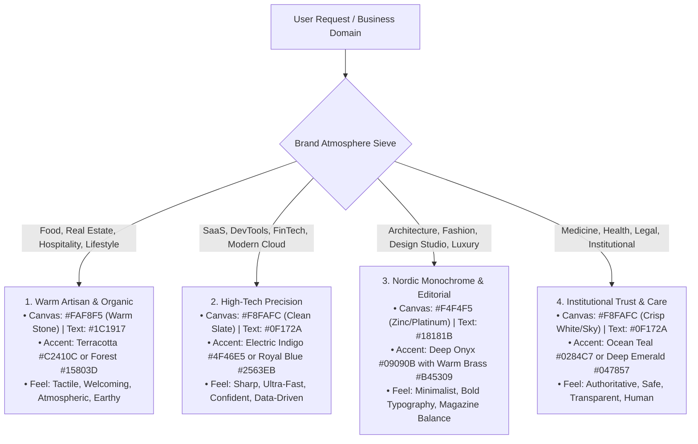

# Human Art Direction & Brand Soul System (v14.0)
### Bespoke, Character-Rich Digital Products Crafted with Human Emotion & Intent

> **THE GOLDEN ART DIRECTION LAW**:
> **Never build identical, cookie-cutter, sterile templates where every website looks like the exact same generic SaaS clone. A boutique bakery, an architectural residential complex, a high-speed developer tool, and a medical clinic must each have their OWN distinct personality, visual atmosphere, typographic weight, and tailored layout structure.**

---

## 1. THE 4 BRAND ATMOSPHERES & PALETTES

Before designing, select the emotional atmosphere that matches the client's industry:



---

## 2. BESPOKE INDUSTRY-SPECIFIC LAYOUT SCENARIOS

**STRICT BAN ON IDENTICAL COOKIE-CUTTER TEMPLATES**: Do not blindly copy the same generic `Hero -> Bento 2x3 -> 3 Pricing -> FAQ` layout for every site. Build a tailored narrative flow based on what real customers need:

### Scenario A: Real Estate / Residential Complexes / Architecture
1. **Hero**: Panoramic visual framing + key residential facts (metro distance, completion date, starting price).
2. **Architectural Concept**: Editorial section with a quote from the lead architect and material swatches (brick, oak, brass).
3. **Interactive Apartment Selector**: Working floor plan sieve with room filter (1-room, 2-room, penthouses), square meters, floor number, price, and visual SVG layout preview.
4. **Surrounding Infrastructure Slider**: 4 key environment cards (parks, schools, transport, fitness) with walking times.
5. **Mortgage & Payment Calculator**: Interactive slider (Down payment, Loan term) calculating the estimated monthly payment.
6. **Sales Office & Visit Booking**: Real address, parking directions, opening hours, and phone consultation form.

### Scenario B: Gastronomy / Restaurants / Cafes & Bakeries
1. **Hero**: Atmospheric hero showcasing the daily specialty, kitchen philosophy, and today's baking time (e.g. «Выпекаем свежий хлеб к 07:30»).
2. **Today's Seasonal Specials**: Highlight card with Chef's recommendation and flavor notes.
3. **Interactive Menu**: Tabbed menu categories (Breakfast, Mains, Pastry, Wine list) with item weights, allergens, and clear prices.
4. **Chef's Note & Team**: Photo card of the head chef/baker with a short 2-sentence quote about farm-fresh sourcing.
5. **Table Reservation Widget**: Real working date/time selector with party size and special requests.
6. **Location Passport**: Map card with subway exit, cozy neighborhood photos, and kitchen operating hours.

### Scenario C: SaaS / Developer Tools / Cloud Platforms
1. **Hero**: High-impact H1 + interactive product demo preview / terminal sandbox right in the hero viewport.
2. **Key Capabilities by Role**: Segmented switcher («For Engineers», «For Product Managers», «For Security Teams»).
3. **Interactive Playground / Configurator**: Live switcher showing code snippets (TypeScript, Python, cURL, Go).
4. **Transparent Pricing Tiers**: 3 tiers with monthly/annual toggle, feature checklist, and instant signup buttons.
5. **Customer Proof & Case Studies**: Real workflow impact cards with quantifiable metrics (e.g. «-65% deployment time»).
6. **Candid FAQ**: Direct, honest answers to real objections (migration, data export, cancellation).

### Scenario D: Clinics / Professional Legal / Consulting Practice
1. **Hero**: Trustworthy headline focusing on patient care or legal success rate + immediate appointment button.
2. **Specialist Credential Cards**: Profiles of doctors/lawyers with university degrees, years of active practice, and specialties.
3. **Treatment / Practice Protocols**: Step-by-step visual roadmap (Diagnostics → Treatment Plan → Recovery).
4. **Transparent Fee Matrix**: Clear breakdown of primary consultation and procedure costs with no hidden fees.
5. **Certificates & Accreditations**: Verified state licenses and clinical partner badges.
6. **Direct Booking Form**: Specialist and date/time selector with privacy guarantee.

---

## 3. HUMAN TOUCHPOINTS (THE SOUL OF THE WEBSITE)

To make a website feel authentically crafted by a human product team, infuse these **Human Touchpoints**:

1. **The Human Voice / Author Note**: Include a sincere quote block with a portrait photo, name, and role (e.g. *«Мы открыли эту пекарню, чтобы на Покровке снова пахло настоящим хлебом» — шеф-пекарь Анна Смирнова*).
2. **Concrete Real-World Factual Details**:
   - Exact hours of operation (`пн–пт: 07:30–22:00, сб–вс: 08:30–23:00`).
   - Exact physical weights, distances, and specs ($180\text{ г}$, $45.2\text{ м²}$, $7\text{ мин пешком}$).
   - Transparent pricing in local currency with explicit tax details.
3. **Thoughtful Micro-Interactions**:
   - Tab switchers that instantly update content.
   - Expandable FAQ accordions with smooth open/close states.
   - Working search/filter bars with immediate results.
   - Interactive sliders with live recalculation.

---

## 4. DESIGN TOKENS & VISUAL DISCIPLINE

```css
:root {
  /* Geometry: Tactile & Human */
  --radius-sm: 6px;    /* Chips, filter tags, small badges */
  --radius-md: 8px;    /* Action buttons, form inputs, search fields */
  --radius-lg: 12px;   /* Content cards, catalog items, pricing tiers */
  --radius-xl: 16px;   /* Modal dialogs, prominent feature frames */
  
  /* Shadows: Soft & Layered */
  --shadow-card: 0 1px 3px rgba(0, 0, 0, 0.04), 0 6px 16px -2px rgba(15, 23, 42, 0.04);
  --shadow-elevated: 0 12px 24px -4px rgba(15, 23, 42, 0.08), 0 4px 6px -2px rgba(0, 0, 0, 0.03);
}
```

### Typography Hierarchy:
* **Primary UI & Text**: `Plus Jakarta Sans`, `Inter`, or `Manrope` in clean `font-sans`.
* **Headings**: Tight tracking (`tracking-[-0.03em]`), bold weights (700/800), clean line height (1.1–1.2).
* **Numbers & Prices**: Tabular figures (`font-variant-numeric: tabular-nums font-mono`) for numerical precision.

---

## 5. HARD INVARIANTS (WHAT IS STRICTLY FORBIDDEN)

1. 🚫 **NO Cookie-Cutter Cloning**: Never use the exact same template structure for different industries. Tailor the sections to the specific topic!
2. 🚫 **NO Meta-Theory or AI Jargon**: Never output text about "Anti-Slop", "AI models", or "Honeypots". The site is 100% about the user's real business.
3. 🚫 **NO Pseudo-Architectural Line Stamps**: Never draw horizontal lines with stamps like `05 / ЛОКАЦИЯ` or `07 / ГАЛЕРЕЯ`. Use clean category tags above H2.
4. 🚫 **NO Fake GPS Coordinates in Titles**: Write normal human addresses: `Екатеринбург, ул. Брусничная, 7 (м. Динамо)`.
5. 🚫 **NO Vertical 'SCROLL' Sticks & Marquees**: Keep vertical rhythm calm and natural with 60px–100px padding.
6. 🚫 **NO Monospace Font on Navigation & Buttons**: Buttons and header links MUST use readable `font-sans` (13px–15px).
7. 🚫 **NO Micro-Text Below 11px**: Minimum font size is 11px for badges, 14px–16px for body text.
8. 🚫 **NO Emoji in Interface**: No `🚀`, `✨`, `⚡`, `💡` in headings or badges. Use clean 1.5px monoline SVGs.
9. 🚫 **NO Dead Controls**: Every tab, filter, accordion, and slider must have working JavaScript handlers.

---

## 6. PRE-FLIGHT ART DIRECTION AUDIT

Before outputting code, verify:
- [ ] **1. Unique Brand Character**: The design reflects the specific industry mood (Warm Artisan / Tech / Nordic / Trust).
- [ ] **2. Bespoke Layout Flow**: Sections match the real user journey, not a sterile generic template.
- [ ] **3. Human Touchpoints Present**: Sincere quotes, concrete numbers, and authentic details.
- [ ] **4. Working Interactivity**: All filters, sliders, tabs, and accordions respond to user clicks.
- [ ] **5. Zero Gimmicks**: No line stamps `05/TITLE`, no GPS coords, no monospace buttons, no emoji spam.