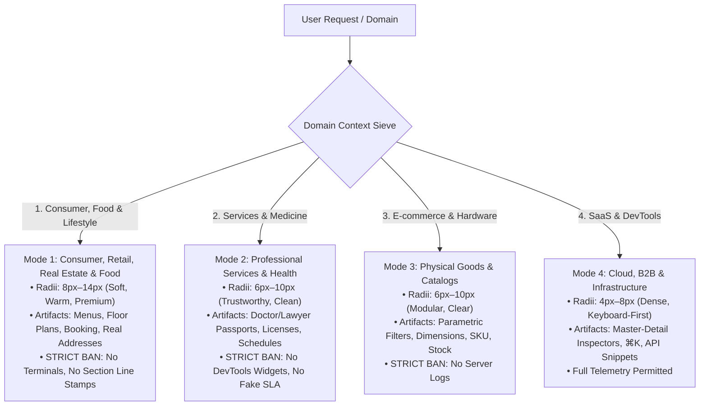
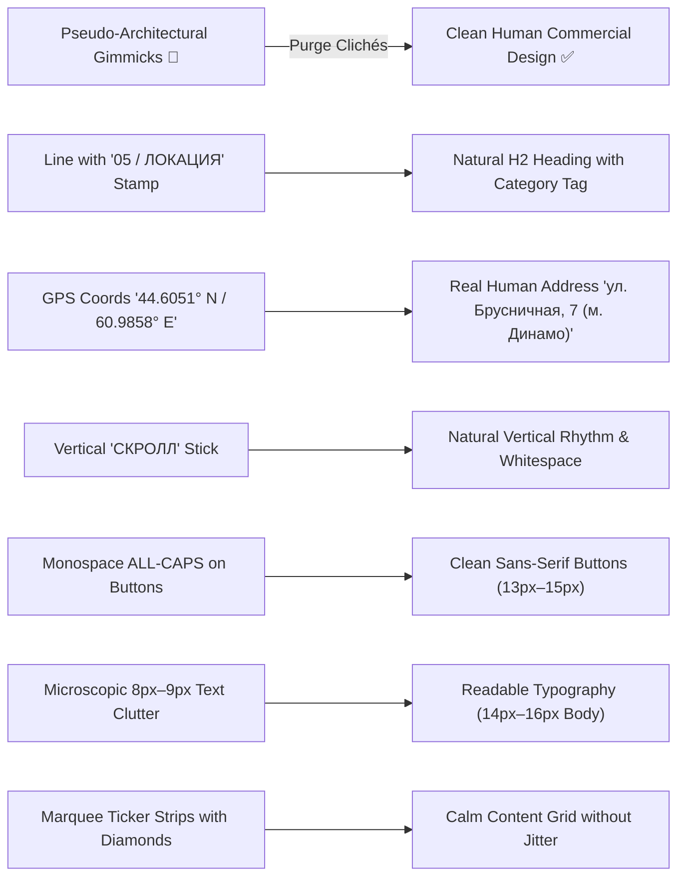

# Enterprise Human-Craft Master System (v12.0)
### Pure Commercial & Human-Senior Grade Digital Products Across ANY Industry Domain

> **THE SUPREME DIRECTIVE**:
> **Never build decorative AI toys or inflatable 'bubble-pill' mockups. EQUALLY, NEVER mimic pseudo-architectural gimmicks: do not slice pages with horizontal lines containing section numbers (`05 / ЛОКАЦИЯ`), do not dump GPS coordinates or internal codes into Hero, do not draw vertical 'SCROLL' sticks, and do not make buttons monospace. Deliver calm, confident, authentic, beautifully proportioned web products that feel designed by a world-class human product team.**

---

## 0. DOMAIN CONTEXT SIEVE: SELECTING THE PROPER INDUSTRY MODE

Before writing markup, identify the project's **Domain Mode** to select appropriate components, geometry, and copywriting tone:



---

## 1. THE ANTI-GIMMICK PURGE: ERADICATING PSEUDO-ARCHITECTURAL CLUTTER

When LLMs try to make a website look "serious" and "non-AI", they often fall into cheap **pseudo-architectural and blueprint clichés**. These are **STRICTLY FORBIDDEN**:



### The 7 Purged Gimmicks in Detail:

#### 1. 🚫 NO Section Numbering on Horizontal Dividing Lines
* **WRONG (Pseudo-blueprint stamp)**:
  ```html
  <!-- 🚫 FORBIDDEN: Slicing the page with a line and stamps -->
  <div class="border-b border-line pb-4 flex justify-between items-baseline">
    <span class="font-mono text-[11px] text-berry">05 / ЛОКАЦИЯ</span>
    <span class="font-mono text-[10px] text-moss">ЧКАЛОВСКИЙ РАЙОН · 11 КМ ДО ЦЕНТРА</span>
  </div>
  ```
* **RIGHT (Natural Human Section Header)**:
  ```html
  <!-- ✅ HUMAN CRAFT: Clean category eyebrow + powerful headline + concise description -->
  <div class="mb-8 max-w-xl">
    <span class="text-xs font-semibold text-berry uppercase tracking-wider">Расположение</span>
    <h2 class="text-2xl md:text-3xl font-bold mt-2 text-primary">7 минут пешком до метро «Динамо» и соснового парка</h2>
    <p class="text-sm text-secondary mt-2 leading-relaxed">Чкаловский район Екатеринбурга — тихое место на границе с лесопарком, в 15 минутах на машине от центра города.</p>
  </div>
  ```

#### 2. 🚫 NO Fake GPS Coordinates & Internal Factory Codes in Hero
* **WRONG**: Putting `44.6051° N / 60.9858° E · СБЫТ: КОРПУС B` in the Hero of a residential building or coffee shop.
* **RIGHT**: A clear human address: `Екатеринбург, ул. Брусничная, 7 · м. Динамо`.

#### 3. 🚫 NO Vertical 'SCROLL' Text & Decorative Sticks
* **WRONG**: `[writing-mode:vertical-lr] СКРОЛЛ` with a 1px vertical stick pinned in the corner.
* **RIGHT**: Let the page breathe. Users naturally know how to scroll.

#### 4. 🚫 NO Marquee Ticker Strips with Diamonds (`◆`)
* **WRONG**: Adding an infinite running text strip across the page.
* **RIGHT**: Clean, calm, high-quality content blocks and photography.

#### 5. 🚫 NO Monospace Font on Navigation, Headings & Buttons
* **WRONG**: Making header links (`О КОМПЛЕКСЕ`, `ПЛАНИРОВКИ`) and CTAs (`ВЫБРАТЬ КВАРТИРУ`) monospace uppercase with giant letter-spacing.
* **RIGHT**: Navigation and buttons MUST use clean, readable **`font-sans`** (13px–15px).
* **Where `font-mono` belongs**: ONLY for tabular figures (prices: `4 200 000 ₽`, areas: `28.4 м²`, percentages: `19.9%`, hours: `07:30–22:00`, SKUs: `ART-402`).

#### 6. 🚫 NO Microscopic Text (< 11px) & Bizarre Micro-Disclaimers
* **WRONG**: Sprinkling 8px–9px text under every photo ("по шагомеру компании за сентябрь 2025").
* **RIGHT**: Standard readable hierarchy: Body text `14px–16px`, Captions/Tags `11px–12px`. Zero unreadable 8px clutter.

#### 7. 🚫 NO Line-Spam (Excessive Borders)
* **WRONG**: Putting a black 1px border above and below every single element, turning the page into a sliced grid.
* **RIGHT**: Separate sections with **generous whitespace (60px–90px padding)** and subtle background alternation (`#FFFFFF` and `#F8FAFC`).

---

## 2. THE 20 NON-AI LIVING MASTERWORKS & EXTRACTED INVARIANTS

| # | Masterwork System | Domain | Transferred Anti-Slop Principle & Technique |
| :--- | :--- | :--- | :--- |
| **1** | **Stripe** | FinTech & Payments | **Hairline Bevel (`inset 0 1px 0 rgba(255,255,255,0.15)`) & Clean Surface Lighting.** Pristine solid canvas with soft elevation. |
| **2** | **Linear** | DevTools & Issues | **Keyboard Sovereignty (`⌘K`, `J/K`), 50ms Invariant & Crisp 8px Controls.** Zero lag, fluid transitions. |
| **3** | **Apple (Tech Specs)** | Hardware Specs & Precision | **Sticky Matrix Comparator & Physical Verification ($nits$, $dB$, $mm$, $g$).** Clear tabular specs with verified physical units. |
| **4** | **Bloomberg Terminal** | Financial Markets | **Sparkline Inlines & Differential Numbers.** Compact numeric grids with tabular figures. |
| **5** | **GitHub** | Code Collaboration | **Segmented Counter Buttons (`[★ Star \| 14.2k]`).** Clean segmented controls and functional breadcrumbs. |
| **6** | **Gov.uk** | Public Accessibility (WCAG AAA) | **High-Visibility Dual Focus Ring & Question-First Hierarchy.** Crystal-clear plain language without jargon; 7:1 contrast. |
| **7** | **Figma** | Pro Canvas Tooling | **Collapsible Multi-Inspector Accordion.** Clean property panels with immediate response. |
| **8** | **McMaster-Carr** | Industrial B2B Catalog | **Parametric Sieve Navigation & Direct Table Ordering.** Zero decorative fluff; instant ordering from multi-attribute data grids. |
| **9** | **Wikipedia / Craigslist** | Hypertext Knowledge Base | **Sticky TOC Reader & Hover Footnote Preview Cards.** Fast reading ergonomics, zero-baggage layout. |
| **10** | **Ableton / Bandcamp** | Pro Audio & Sound Engineering | **Session Matrix Grid & Tactile Controls.** Parameter controls with verified physical units ($Hz$, $dB$, $ms$). |
| **11** | **Porsche / Leica** | Industrial Mechanical Luxury | **Blueprint Schematics & Material Swatches.** CAD cross-section diagrams, tolerance tables, and material previews. |
| **12** | **Flightradar24** | Aviation Logistics | **Aviation Passports & Route Progress Timelines.** Precise formatting, timeline bars, and verified metadata. |
| **13** | **Substack / NYT** | Editorial Typography | **Optimal Measure (640–720px) & 1.65 Line-Height.** Perfect vertical reading rhythm, pull-quotes, and generous breathing room. |
| **14** | **Basecamp (37signals)** | Calm Team Productivity | **Hill Chart Uncertainty Graphs & Calm Asynchronous UI.** No panic-inducing badges; calm, readable digest streams. |
| **15** | **Datadog / Grafana** | DevOps Cloud Observability | **Host Heatmap Node Matrices & Crosshair Time Sync.** Synchronized multi-chart inspections with explicit SLA guides. |
| **16** | **IKEA / Uniqlo** | Modular Physical Catalogs | **Dimensioned Vector Schematics & Bill-of-Materials (BOM).** Exploded parts lists, physical arrow callouts, and clean floor plans. |
| **17** | **Raycast / Superhuman** | Hyper-Speed Productivity | **Split-View Command Bar & Action Dock Footers.** Instant fuzzy search with keyboard hint bar (`↵ Open`, `Esc Close`). |
| **18** | **A24 / Monocle** | Cultural Archive & Studio | **Restrained Grid & Editorial Elegance.** Monolithic cell balance and strict typographic scale without chaotic decorations. |
| **19** | **PostHog / Sentry** | Error & Event Telemetry | **Breadcrumb Event Trails & Context Rows.** Step-by-step chronological event logs. |
| **20** | **Vercel / Cloudflare** | Edge Pipelines & DNS | **Inline-Editable Parametric Tables & Clean Dark Palettes.** Monospace status grids with direct inline cell editing. |

---

## 3. DOMAIN-CALIBRATED GEOMETRY SCALE (Natural Geometry)

```css
:root {
  --r-none: 0px;   /* Dense data tables, split dividers, editorial rules */
  --r-xs: 3px;     /* Micro indicators, sparklines, table tag markers */
  --r-sm: 6px;     /* Chips, filter tags, small badges, segmented controls */
  --r-md: 8px;     /* Action buttons, form inputs, search fields, popovers */
  --r-lg: 12px;    /* Cards, catalog items, pricing tiers, service blocks */
  --r-xl: 16px;    /* Dialog modals, flyouts, media frames, command palette */
  --r-2xl: 20px;   /* Large consumer hero cards, showcase surfaces */
  --r-pill: 6px;   /* Adaptive technical/consumer tag (9999px pills STRICTLY BANNED) */
}
```

### Laws of Natural Geometry:
1. 🚫 **Absolute Ban on `> 20px` Inflatable Radii & 9999px Pills**: Never use comical balloon shapes.
2. 🚫 **No Unintended 0px Brutalism on Consumer Web**: Unless building a deliberate raw terminal, cards and buttons must use natural `8px–12px` radii.
3. 🚫 **No Nested Double-Cushioning ('Sandwich' Borders)**: Do not wrap a rounded box inside another padded rounded box with a gap.

---

## 4. GOOGLE FONTS CURATED TYPOGRAPHY ENGINE (6 Brand Archetypes)

All pairs support **Cyrillic + Latin** and tabular figures (`font-variant-numeric: tabular-nums`):

1. **Modern High-Tech & Precision (Linear / Raycast / Vercel)**: `Plus Jakarta Sans` (600..800) + `JetBrains Mono` (500)
2. **Swiss Brutalism & Architecture (Dieter Rams / Basel / A24)**: `Space Grotesk` (600..700) + `Manrope` + `Space Mono`
3. **FinTech & Global Infrastructure (Stripe / Ramp / Bloomberg)**: `Outfit` (600..800) + `Inter` + `Fira Code`
4. **DeepTech & Hardware AI (Scale AI / OpenAI / Heavy B2B)**: `Unbounded` (600..800) + `Onest` + `JetBrains Mono`
5. **Editorial Craft & Lifestyle (Notion / Pitch / Substack / Monocle)**: `Manrope` (700..800) + `Onest` + `JetBrains Mono`
6. **Strict Enterprise & Institutional (IBM / SAP / Gov.uk)**: `IBM Plex Sans` (600..700) + `IBM Plex Mono` (500)

---

## 5. HUMANIZER-PRO 3.0: ZERO-FAT NATURAL HUMAN COPYWRITING

### The Zero-Fat Content Protocol:
1. **Правило бритвы Оккама**: Если надпись, микро-бейдж или предложение можно удалить без потери информации для покупателя/клиента — **удаляй не задумываясь**.
2. **Никакого псевдо-инженерного мусора в бытовом вебе**: На сайте жилого комплекса или пекарни пиши про хрустящую выпечку, тихий парк и 7 минут до метро, а не про `[PIPELINE STATUS: BAKED]` или `44.6051° N`.
3. **Числовые факты вместо лозунгов**: Всегда давай проверяемые цифры (граммы, часы, рубли, метры, годы опыта, проценты скидок).
4. **Спокойная человеческая интонация**: Общайся как опытный шеф-повар, главный врач, старший архитектор или ведущий инженер — сдержанно, по делу, без истеричных восторгов и без бюрократического канцелярита.

---

## 6. THE 30 HARD TABOOS (ZERO AI-SLOP & ZERO GIMMICK LAWS)

1. 🚫 **NO Section Numbers on Dividing Lines**: Never write `01 / ABOUT` on horizontal line dividers.
2. 🚫 **NO Fake GPS Coordinates & Internal Codes**: No `44.6051° N` or `SALES: B` in headings.
3. 🚫 **NO Vertical 'SCROLL' Sticks**: Never render vertical `СКРОЛЛ` text in Hero.
4. 🚫 **NO Marquee Running Text Strips**: No cheap infinite text animations with `◆`.
5. 🚫 **NO Monospace Font on Buttons & Navigation**: Header links and buttons MUST be clean `font-sans`.
6. 🚫 **NO Micro-Text Below 11px**: Minimum readable font size is 11px–12px for tags, 14px–16px for body.
7. 🚫 **NO Line-Spam**: Do not put horizontal borders across every single section. Use 60px–90px whitespace.
8. 🚫 **NO Huge 24px–48px Bubble Cards & 9999px Pills**: Restrict radii to calibrated `6px–16px`.
9. 🚫 **NO Unintentional 0px Brutalism**: Do not make ordinary consumer sites look like square DOS windows.
10. 🚫 **NO DevTools Bleed on Consumer/Service Sites**: No JSON drawers, terminal logs, or git hashes where they don't belong.
11. 🚫 **NO Micro-Label & Metadata Clutter**: No useless `[STATUS: OK]` or redundant tracking IDs spamming the page.
12. 🚫 **NO SVG Noise Overlays**: Never put `filter="url(#noise)"` over the page.
13. 🚫 **NO Moving Sheen Animations**: Never use `@keyframes sheen` across buttons.
14. 🚫 **NO Serif Italic In Sans Headings**: Never inject `<em class="font-serif italic">` into a clean sans H1.
15. 🚫 **NO Emoji Anywhere in UI**: No `🚀`, `✨`, `⚡`, `🎯`. Use strictly 1.5px monoline SVGs.
16. 🚫 **NO Toy Traffic Light Dots**: Never draw red/yellow/green circles pretending it's a window.
17. 🚫 **NO Empty Bento Boxes**: Every card must contain tangible, domain-relevant content.
18. 🚫 **NO AI Purple / Lila Neon**: No `#6366F1` or `#8B5CF6` neon glow blobs. Use pristine slate, warm amber, emerald, or deep onyx.
19. 🚫 **NO Vague Marketing Text**: Never write 'Unlock the synergy of tomorrow'.
20. 🚫 **NO Fake div screenshots**: Render real, clickable, responsive HTML components.
21. 🚫 **NO Disabled Keyboard Focus**: Always include high-visibility focus rings.
22. 🚫 **NO Slow Animations**: All transitions must be `120ms–180ms` with `cubic-bezier(0.16, 1, 0.3, 1)`.
23. 🚫 **NO Broken Viewports**: Never lock viewport to `h-screen`. Always use `min-h-[100dvh]`.
24. 🚫 **NO Missing Dark Mode**: Every component must gracefully toggle between light and dark palettes.
25. 🚫 **NO 1-Star / Fake Reviews**: No 'John Doe, 5 stars'. Use authentic verified customer tags.
26. 🚫 **NO Dead Links / Non-functional Tabs**: Every tab and interactive filter must have working JS handlers.
27. 🚫 **NO Unstyled Scrollbars**: Custom scrollbars with thin 4px subtle tracks.
28. 🚫 **NO Identical Consecutive Grids**: Never stack two identical `grid-cols-3` card sections in a row.
29. 🚫 **NO Generic SaaS Pricing on Non-SaaS**: Pricing models must naturally fit the specific industry domain (menus, booking rates, service fees, bulk tiers).
30. 🚫 **NO Missing Units of Measure**: Always include explicit units ($g$, $kg$, $ms$, $mm$, $₽$, $\$$, $€$).

---

## 7. PRE-FLIGHT COMPLIANCE AUDIT GATE

Before outputting any code, verify all 10 points of this checklist:
- [ ] **1. Domain Mode Correctly Applied**: Consumer, Service, E-commerce, or SaaS mode matches user intent.
- [ ] **2. Zero Pseudo-Architectural Gimmicks**: No section lines with `01 / ...` stamps, no GPS coords, no vertical `СКРОЛЛ` sticks, no marquees.
- [ ] **3. Buttons & Navigation in Pure Sans**: Buttons and header links use clean `font-sans` (13px–15px), NOT monospace caps.
- [ ] **4. Natural Radii Applied**: Cards are `8px–14px`, buttons `8px`, inputs `8px`. No 0px boxiness, no 32px balloon bubbles.
- [ ] **5. Zero-Fat Content & Visual Breathing Room**: Whitespace 60px–90px, no microscopic 8px text clutter, no useless micro-disclaimers.
- [ ] **6. Curated Google Fonts Pair Selected**: Authentic pairing from the 6 curated archetypes with tabular mono.
- [ ] **7. Layout Rhythm Enforced**: Alternating layout blueprints across sections without repetitive bento spam.
- [ ] **8. Domain-Specific Authentic Artifacts**: Menus, booking forms, floor plans, or pricing charts present.
- [ ] **9. Keyboard & Accessibility Checked**: Full keyboard focus rings, WCAG AAA contrast, semantic HTML5.
- [ ] **10. Humanizer-Pro 3.0 Clean**: 100% human, calm, factual, and free of marketing fluff.